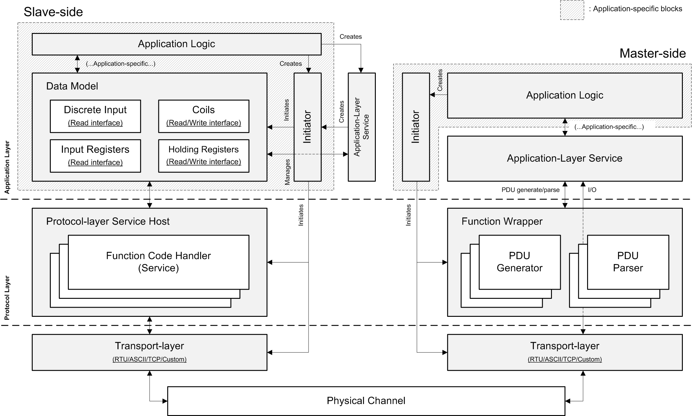

## Usage Guide

### Introduction

This usage guide gives you provision of this package. It is highly recommended to read the example codes along with this guide.

### High Level Structure

#### Overview

A Modbus system that uses this package implements a layered solution, as shown in following diagram:



The layers are:
 - <b>Application Layer</b>: The application layer implements higher logic that uses Modbus protocol as underlying communication mechanism.
 - <b>Protocol Layer</b>: The protocol layer wraps function codes defined in the "[Modbus Application Protocol Specification](https://modbus.org/docs/Modbus_Application_Protocol_V1_1b3.pdf)".
   - On master side, the protocol layer implements classes and routines that generate and parse the Modbus Protocol Data Unit (PDU).
   - On slave side, the protocol layer wraps a series of protocol-layer service and each protocol-layer service can handle one specific function code. A protocol-layer service host provides registration of different protocol-layer services.
 -   <b>Transport Layer</b>: The transport layer encodes and decodes Protocol Data Unit (PDU) to/from underlying physical/communication channel (e.g. serial port, TCP).

All blocks with gray-line background are application-specific blocks that should be provided by your upper application. All other function blocks are provided by this package.

### Slave-side

#### Data Model

Data model block implements generic coil/register operations (including read, write and validate) defined in the protocol specification. It is totally application-specific, so it is implementation is out of the scope of this package (with only interface class provided).

A data model block should be implemented by creating a class that implements **[IMBDataModel](../modbus/model/core.js)** interface. A data model class implements following interfaces:

<table>
<thead>
<th>Catagory</th>
<th>Interface Name</th>
<th>Interface Description</th>
</thead>
<tbody>
<tr>
<td rowspan="1">Unit(slave) selection</td>
<td>model.select(unitId)</td>
<td>Select an unit (slave) identifier.</td>
</tr>
<tr>
<td rowspan="3">Discrete Input operations</td>
<td>model.prefetchDiscreteInput(address, count[, cancellator])</td>
<td>Prefetch discrete input(s).</td>
</tr>
<tr>
<td>model.isValidDiscreteInput(address)</td>
<td>Check whether the address of a discrete input is valid.</td>
</tr>
<tr>
<td>model.readDiscreteInput(address)</td>
<td>Read the value of specified discrete input.</td>
</tr>
<tr>
<td rowspan="4">Coil operations</td>
<td>model.prefetchCoil(address, count[, cancellator])</td>
<td>Prefetch coil(s).</td>
</tr>
<tr>
<td>model.isValidCoil(address)</td>
<td>Check whether the address of a coil is valid.</td>
</tr>
<tr>
<td>model.readCoil(address)</td>
<td>Read the value of specified coil.</td>
</tr>
<tr>
<td>model.writeCoil(address, value)</td>
<td>Write the value of specified coil.</td>
</tr>
<tr>
<td rowspan="3">Input Register operations</td>
<td>model.prefetchInputRegister(address, count[, cancellator])</td>
<td>Prefetch input register(s).</td>
</tr>
<tr>
<td>model.isValidInputRegister(address)</td>
<td>Check whether the address of an input register is valid.</td>
</tr>
<tr>
<td>model.readInputRegister(address)</td>
<td>Read the value of specified input register.</td>
</tr>
<tr>
<td rowspan="4">Holding Register operations</td>
<td>model.prefetchHoldingRegister(address, count[, cancellator])</td>
<td>Prefetch holding register(s).</td>
</tr>
<tr>
<td>model.isValidHoldingRegister(address)</td>
<td>Check whether the address of a holding register is valid.</td>
</tr>
<tr>
<td>model.readHoldingRegister(address)</td>
<td>Read the value of specified holding register.</td>
</tr>
<tr>
<td>model.writeHoldingRegister(address, value)</td>
<td>Write the value of specified holding register.</td>
</tr>
<tr>
<td rowspan="2">Lock</td>
<td>model.transactionLock([cancellator])</td>
<td>Acquire the transaction lock.</td>
</tr>
<tr>
<td>model.transactionUnlock()</td>
<td>Release the transaction lock.</td>
</tr>
</tbody>
</table>

Each Modbus transaction has following data model operation stages:

 - <b>Acquire the transaction lock</b>: The data model would be locked so that only one transaction can have access to the data model at anytime.
 - <b>Select the unit(slave)</b>: The unit(slave) ID would be provided to the data model, and the data model has to determine whether the unit(slave) ID is acceptable.
 - <b>Prefetch</b>: The type of resource that the master wants to access (e.g. coil, input register, ...) and the address range would be provided to the data model. The data model have to prepare the resources for subsequent access.
   - For example, if certain resources locate on external medium (e.g. harddisk), you have to load the resources and their vailidity to the data model at this stage.
 - <b>Validity</b>: The address and quantity of resources that the master wants to access would be checked during this stage.
 - <b>Read/write</b>: Value(s) would be read/write from/to the specified resource location.
 - <b>Release the transaction lock</b>: The data model would be unlocked at the end of the transaction.

For example, if a master wants to read coil 0x0000 to 0x0004 from slave 1, operations to the data model would look like:

  - Acquire the transaction lock.
  - Select slave 1.
    - If the data model rejects the slave number (e.g. it mismatches with the slave ID of the device), it simply throw a specified exception.
  - Prefetch coil starts at address 0x0000 and 5 coils should be prefetched.
    - The validity and values of coil 0x0000 to 0x0004 would be read to the data model.
  - Validate coil 0x0000, 0x0001, ..., 0x0004.
  - Read the status(value) of coil 0x0000, 0x0001, ..., 0x0004.
  - Release the transaction lock.

#### Protocol-layer service

A protocol-layer service (which implements <b>[IMBSlaveProtocolService](../modbus/protocol/slave/service.js)</b> interface) translates query PDU with specific function code to data model access primitives and generates answer PDU that would be sent back to the master.

The protocol-layer service classes for following standardized function codes are provided along with this package:

<table>
<thead>
<th>Function Code</th>
<th>Function Name</th>
<th>Protocol-layer Service Class</th>
</thead>
<tbody>
<tr>
<td>0x01</td>
<td>Read Coils</td>
<td><a href="../modbus/protocol/slave/builtins/service-fc01.js">MBSlaveProtocolReadCoilsService</a></td>
</tr>
<tr>
<td>0x02</td>
<td>Read Discrete Inputs</td>
<td><a href="../modbus/protocol/slave/builtins/service-fc02.js">MBSlaveProtocolReadDiscreteInputService</a></td>
</tr>
<tr>
<td>0x03</td>
<td>Read Holding Registers</td>
<td><a href="../modbus/protocol/slave/builtins/service-fc03.js">MBSlaveProtocolReadHoldingRegisterService</a></td>
</tr>
<tr>
<td>0x04</td>
<td>Read Input Registers</td>
<td><a href="../modbus/protocol/slave/builtins/service-fc04.js">MBSlaveProtocolReadInputRegisterService</a></td>
</tr>
<tr>
<td>0x05</td>
<td>Write Single Coil</td>
<td><a href="../modbus/protocol/slave/builtins/service-fc05.js">MBSlaveProtocolWriteSingleCoilService</a></td>
</tr>
<tr>
<td>0x06</td>
<td>Write Single Register</td>
<td><a href="../modbus/protocol/slave/builtins/service-fc06.js">MBSlaveProtocolWriteSingleRegisterService</a></td>
</tr>
<tr>
<td>0x0F</td>
<td>Write Multiple Coils</td>
<td><a href="../modbus/protocol/slave/builtins/service-fc0f.js">MBSlaveProtocolWriteMultipleCoilsService</a></td>
</tr>
<tr>
<td>0x10</td>
<td>Write Multiple Registers</td>
<td><a href="../modbus/protocol/slave/builtins/service-fc10.js">MBSlaveProtocolWriteMultipleRegistersService</a></td>
</tr>
</tbody>
</table>

If the slave supports specified function code, the protocol-layer service must be registered to the service host which is an instance of class <b>[MBSlaveProtocolServiceHost](../modbus/protocol/slave/service.js)</b>.

Here is a code piece from [examples/01-modbus-tcp-server/server.js](../examples/01-modbus-tcp-server/server.js) which demostrates how to register protocol-layer services to the service host of the protocol-layer subsystem:

```
...
this.initiateProtocolLayer = async  function(
    cancellator = new  ConditionalSynchronizer()
) {
    let protocolLayer = new MBSlaveProtocolLayer();
    let services = protocolLayer.getServiceHost();
    services.register(MBSlaveProtocolReadCoilsService.INSTANCE);
    services.register(MBSlaveProtocolReadDiscreteInputService.INSTANCE);
    services.register(MBSlaveProtocolReadHoldingRegisterService.INSTANCE);
    services.register(MBSlaveProtocolReadInputRegisterService.INSTANCE);
    services.register(MBSlaveProtocolWriteSingleCoilService.INSTANCE);
    services.register(MBSlaveProtocolWriteSingleRegisterService.INSTANCE);
    services.register(MBSlaveProtocolWriteMultipleCoilsService.INSTANCE);
    services.register(MBSlaveProtocolWriteMultipleRegistersService.INSTANCE);
    return protocolLayer;
};
...
```

#### Protocol-layer subsystem

The protocol-layer subsystem is implemented in <b>[MBSlaveProtocolLayer](../modbus/protocol/slave/layer.js)</b> class. It wraps the protocol-layer service host and shall be initialized by the initiator during system startup.


#### Transport-layer subsystem

The transport-layer subsystem abstracts PDU reception/transmission from the protocol-layer and application-layer. The only mission of the upper application to the transport-layer is to select and create a transport-layer subsystem with specified configuration.

A transport-layer subsystem is an implementation of interface class <b>[IMBSlaveTransport](../modbus/transport/core.js)</b> and <b>[IMBSlaveTransportFactory](../modbus/transport/core.js)</b>.

Currently, this package provides following transport-layer subsystem:

<table>
<tbody>
<tr>
<td rowspan="2">Serial (typically RS485)</td>
<td>RTU</td>
<td><a href="../modbus/transport/serial/rtu/slave/slrtuslave-transport.js">MBRtuSlaveTransport</a>, <a href="../modbus/transport/serial/rtu/slave/slrtuslave-transport.js">MBRtuSlaveTransportFactory</a></td>
</tr>
<tr>
<td>ASCII</td>
<td><a href="../modbus/transport/serial/ascii/slave/slasciislave-transport.js">MBAsciiSlaveTransport</a>, <a href="../modbus/transport/serial/ascii/slave/slasciislave-transport.js">MBAsciiSlaveTransportFactory</a></td>
</tr>
<tr>
<td>TCP/IP</td>
<td>TCP</td>
<td><a href="../modbus/transport/tcp/slave/tcpslave-transport.js">MBTCPSlaveTransport</a>, <a href="../modbus/transport/tcp/slave/tcpslave-transport.js">MBTCPSlaveTransportFactory</a></td>
</tr>
</tbody>
</table>

Here is a code piece from [examples/01-modbus-tcp-server/server.js](../examples/01-modbus-tcp-server/server.js) which demostrates how to create (initialize) a transport-layer subsystem:

```
this.initiateTransportLayer = async function(
    cancellator = new ConditionalSynchronizer()
) {
    let factory = new MBTCPSlaveTransportFactory();
    return await factory.create({
        "bind": {
            "address": MY_SERVER_HOST,
            "port": MY_SERVER_PORT
        },
        "exclusive": true,
        "dualstack": true,
        "max-connections": null,
        "parallel": 1024,
        "timeout": {
            "idle": 60000
        }
    }, cancellator);
};
```

The configuration guide can be found in Transport-Layer Subsystem Configuration Guide ([TCP](transport-layer/tcp-configguide.md), [RTU](transport-layer/rtu-configguide.md), [ASCII](transport-layer/ascii-configguide.md)).

#### Initiator

Initiator class provides implementation of <b>[IMBSlaveServiceInitiator](../modbus/service/slave.js)</b> interface. It has the responsibility to initialize all subsystems, including:

 - The protocol-layer subsystem.
 - The transport-layer subsystem.
 - The data model.

#### Application-Layer Service

The application-layer service implemented in <b>[MBSlaveService](../modbus/service/slave.js)</b> class wraps the whole life-cycle of a Modbus slave. It has the responsibility to:

 - Initialize subsystems by using the initiator.
 - Coordinate all subsystems.
 - Finalize subsystems (when application requests).

Here is a code piece from [examples/01-modbus-tcp-server/server.js](../examples/01-modbus-tcp-server/server.js) which demostrates the general usage of the application-layer service:

```
//  Create a slave service.
let slaveInitiator = new MBExampleSlaveServiceInitiator();
let slave = await MBSlaveService.Create(slaveInitiator);

//  Handle SIGINT.
Process.on("SIGINT", function() {
    if (!slave.isClosed()) {
        slave.close(true);
    }
});

//  Wait for the server to be closed.
console.log("Use Ctrl+C to stop the server...");
await slave.wait();
console.log("The server has been stopped.");
```
### Master-side

#### Command (Function Wrapper)

A command (or "Function Wrapper") is an instance of <b>[MBMasterProtocolCommand](../modbus/protocol/master/cmd.js)</b> class. It wraps the Protocol Data Unit (PDU) generator used to generate query PDU and parser that parses the answer PDU.

A set of helper routines are provided to create new command object, see following table:

<table>
<thead>
<th>Function Code</th>
<th>Function Name</th>
<th>Routine</th>
</thead>
<tbody>
<tr>
<td>0x01</td>
<td>Read Coils</td>
<td><a href="../modbus/protocol/master/builtins/cmd-fc01.js">NewReadCoilsCommand()</a></td>
</tr>
<tr>
<td>0x02</td>
<td>Read Discrete Inputs</td>
<td><a href="../modbus/protocol/master/builtins/cmd-fc02.js">NewReadDiscreteInputsCommand()</a></td>
</tr>
<tr>
<td>0x03</td>
<td>Read Holding Registers</td>
<td><a href="../modbus/protocol/master/builtins/cmd-fc03.js">NewReadHoldingRegistersCommand()</a></td>
</tr>
<tr>
<td>0x04</td>
<td>Read Input Registers</td>
<td><a href="../modbus/protocol/master/builtins/cmd-fc04.js">NewReadInputRegistersCommand()</a></td>
</tr>
<tr>
<td>0x05</td>
<td>Write Single Coil</td>
<td><a href="../modbus/protocol/master/builtins/cmd-fc05.js">NewWriteSingleCoilCommand()</a></td>
</tr>
<tr>
<td>0x06</td>
<td>Write Single Register</td>
<td><a href="../modbus/protocol/master/builtins/cmd-fc06.js">NewWriteSingleRegisterCommand()</a></td>
</tr>
<tr>
<td>0x0F</td>
<td>Write Multiple Coils</td>
<td><a href="../modbus/protocol/master/builtins/cmd-fc0f.js">NewWriteMultipleCoilsCommand()</a></td>
</tr>
<tr>
<td>0x10</td>
<td>Write Multiple Registers</td>
<td><a href="../modbus/protocol/master/builtins/cmd-fc10.js">NewWriteMultipleRegistersCommand()</a></td>
</tr>
</tbody>
</table>

#### Transport-layer subsystem

A transport-layer subsystem is an implementation of interface class <b>[IMBMasterTransport](../modbus/transport/core.js)</b> and <b>[IMBMasterTransportFactory](../modbus/transport/core.js)</b>.

Currently, this package provides following transport-layer subsystem:

<table>
<tbody>
<tr>
<td rowspan="2">Serial (typically RS485)</td>
<td>RTU</td>
<td><a href="../modbus/transport/serial/rtu/master/slrtumaster-transport.js">MBRtuMasterTransport</a>, <a href="../modbus/transport/serial/rtu/master/slrtumaster-transport.js">MBRtuMasterTransportFactory</a></td>
</tr>
<tr>
<td>ASCII</td>
<td><a href="../modbus/transport/serial/ascii/master/slasciimaster-transport.js">MBAsciiMasterTransport</a>, <a href="../modbus/transport/serial/ascii/master/slasciimaster-transport.js">MBAsciiMasterTransportFactory</a></td>
</tr>
<tr>
<td>TCP/IP</td>
<td>TCP</td>
<td><a href="../modbus/transport/tcp/master/tcpmaster-transport.js">MBTCPMasterTransport</a>, <a href="../modbus/transport/tcp/master/tcpmaster-transport.js">MBTCPMasterTransportFactory</a></td>
</tr>
</tbody>
</table>

#### Initiator

Initiator class provides implementation of <b>[IMBMasterServiceInitiator](../modbus/service/master.js)</b> interface. It has the responsibility to initialize all subsystems, including:

 - The transport-layer subsystem.

